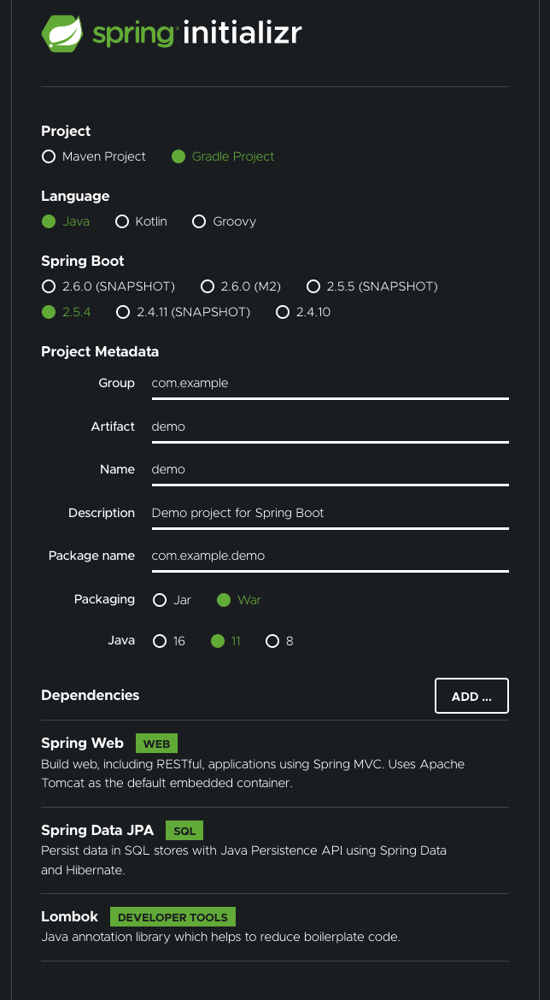
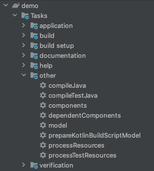

# 01 - Getting Started

To get started, we need an app skeleton. We can easily obtain one at https://start.spring.io/  

Here are the options I've selected when creating this project - 

I've chosen the most common dependencies used to build a REST web service.

## IDE

Among all IDEs for Java development, I find I'm the most efficient in Intellij. I'm using Intellij CE for this project which provides a Gradle tool window (shown in the next section).

## Gradle View

By default, gradle generates the following set of tasks that assist in building and packaging an application - 

We'll be adding more to this set as we go along.