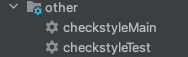

# 02 - Static Code Analysis P1

Before code is ever deployed, a variety of static analyses of quality can be performed. Static analysis can be a great safeguard against costly bugs. We were young developers at one point, and I'm sure we can appreciate how some of these tools have helped us avoid some landmines as well as learn best practices in the field. We'll begin with coding standards 

## Coding Standards
An important aspect of managing a code base as a team is to agree upon certain standards. Why are coding standards important? According to the article [here](https://medium.com/leafgrowio-engineering/why-is-coding-standards-important-319fce79d1a4) - 

"Any developer who is not consistent with things as simple as the naming conventions or documenting and defining functions is buying themselves a big headache, especially if they are working as part of a team (i.e. anything > 1). Imagine any dev team, each developer writing code with their own style; that would look like some Orcs trying to eat the last beefsteak in the Middle-earth.

When we write code, we need to make sure that any developer can understand it easily: tomorrow or in the distant future when you might not be around."

In the world of Java development, Checkstyle is a popular tool to enforce coding standards.

## Checkstyle

As per the Checkstyle [website](https://checkstyle.sourceforge.io/) -

Checkstyle is a development tool to help programmers write Java code that adheres to a coding standard. It automates the process of checking Java code to spare humans of this boring (but important) task. This makes it ideal for projects that want to enforce a coding standard.

## Gradle Plugin

The gradle plugin for Checkstyle can be added to a project by following instructions [here](https://docs.gradle.org/current/userguide/checkstyle_plugin.html)

Once added and after reloading the Gradle project in the Gradle tool window, the following tasks should show up -



## Checkstyle Rules XML

Before you can run the Checkstyle tasks, you need a set of rules that define your coding standards. If you ran the tasks without the rules xml file, you will see the error below -

```
Unable to find: /path/to/workspace/quality-code/config/checkstyle/checkstyle.xml
```


For this project, I've used the Google Java Style Guide, which you can find [here](https://github.com/checkstyle/checkstyle/blob/master/src/main/resources/google_checks.xml). I created a folder named config under the project root folder, created a folder named checkstyle under it and placed a file named checkstyle.xml with the contents of the file in the link.

If you run into issues with certain elements within file when running the Checkstyle tasks, you can comment them out for the time being.

## Results

When you run the checkstyleMain task for the first time, you will see the task exit with "BUILD SUCCEEDED" an output as below - 

```
> Task :checkstyleMain
Checkstyle rule violations were found. See the report at: file:///path/to/workspace/quality-code//build/reports/checkstyle/main.html
Checkstyle files with violations: 2
Checkstyle violations by severity: [warning:15]
```

The task generates a report at the location mentioned above. You can view the files with violations and the nature of the violations in an easy to understand manner. 

The task exited successfully in the first case. However, you might want the task to exit with failure in case of violations. Adding the below lines to the `build.gradle` file will make the task fail - 

```
checkstyle {
  ignoreFailures = false
  maxWarnings = 0
}
```

## Summary 

You are now aware of coding standards, their importance, and an easy way to enforce them in your projects. You might require futher tinkering of the `checkstyle.xml` file to fine tune the rules to your team's requirements. 

Thank you for reading this!
