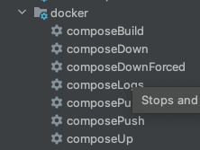

# 06 - Adding Docker Compose Plugin

The docker compose plugin will help us setup test environment on our local machine and enable us to run integration and blackbox tests.

The plugin I'm using is gradle-docker-compose-plugin from avast available [here](https://github.com/avast/gradle-docker-compose-plugin)

When adding this plugin in the build.gradle file, I found that I had to add the repositories section twice. I was puzzled and, as always, StackOverflow helped me understand. [Here](https://stackoverflow.com/questions/13923766/gradle-buildscript-dependencies) is someone having the exact same question many years before I did.

Now we have access to the following tasks - \

With the docker compose plugin setup, we can write a docker-compose.yml and configure the plugin to use that file and create the test environment we need.  