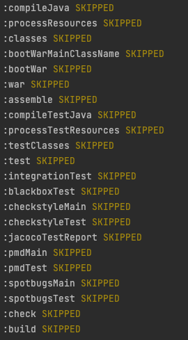

# 04 - Setting Up Tasks For The Three Types Of Tests

In this section, we'll look at how we can add the three different kinds of tests that make up the testing pyramid. The testing pyramid is made up of 

- Unit tests: bottom of pyramid, most number of tests here
- Integration tests: middle of pyramid, used to test interactions between various components. 
- End to end/Blackbox tests: top of the pyramid, least number of tests here.

You can read more about the testing pyramid [here](https://martinfowler.com/articles/practical-test-pyramid.html#TheTestPyramid)

A useful git repo for testing is [here](https://github.com/hamvocke/spring-testing)

## Plugins Used

- Jacoco: Once the integration tests are run, the code coverage report is generated using Jacoco

## Spring Annotations Used

The more important part is configuring tasks that pick up tests in different folders and run them independently. In the unit tests, the annotation ```@ExtendWith(MockitoExtension.class)```  is used whereas in the integration and blackbox tests the annotation ```@SpringBootTest(classes = {DemoApplication.class})``` is used. 

In the unit tests, we don't need the entire application context to test just one class. Hence we don't use the annotation ```@SpringBootTest```. However, when we are testing integrations and performing end to end testing, we do require the entire application context.

If you navigate into ```@SpringBootTest```, you'll find that the following annotations (notice ```@ExtendsWith``` also present here) are used - 


```
@Target(ElementType.TYPE)
@Retention(RetentionPolicy.RUNTIME)
@Documented
@Inherited
@BootstrapWith(SpringBootTestContextBootstrapper.class)
@ExtendWith(SpringExtension.class)
```

We need SpringExtension as it  integrates the Spring TestContext Framework into JUnit 5's Jupiter programming model. An excellent explanation of how to use the ```@ExtendsWith``` annotation is [here](https://stackoverflow.com/questions/61433806/junit-5-with-spring-boot-when-to-use-extendwith-spring-or-mockito).

## Summary 

With the new configurations added to build.gradle, if we execute the command ``````, we see that the task 'build' executes the following - 



We see that when we run the 'build' task, the three tasks for tests are run, and only after a report is generated, the build task proceeds. Now we can use each of these tasks independently during feature development and not have to wait on other test tasks to complete.

Setting up a robust test suite is quintessential to consistently delivering quality software. In the next sections, we'll attempt to bring in containers to create a test environment where we can run integration and end to end cases successfully.

Thank you for reading this!
